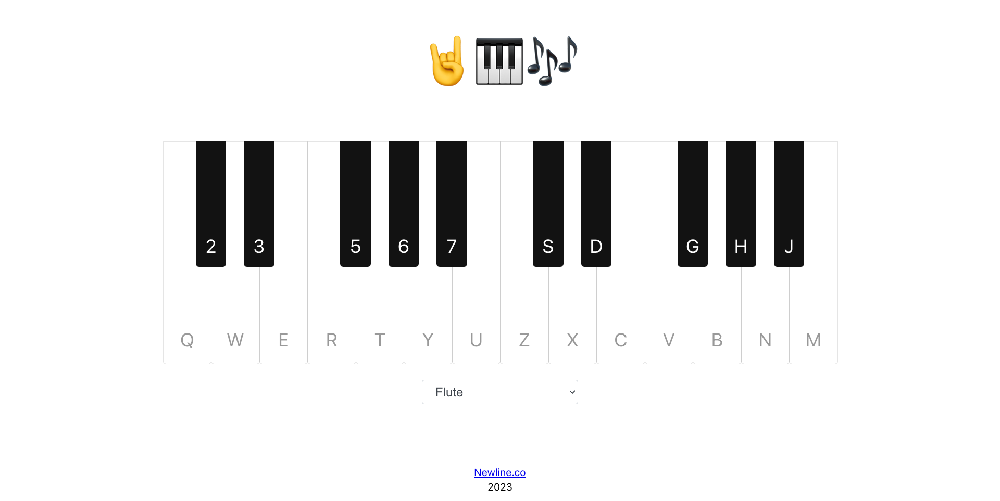

# Virtual Piano Keyboard with Instrument Selection

## Table of Contents

- [Introduction](#introduction)
- [Features](#features)
- [Technologies Used](#technologies-used)
- [Installation](#installation)
- [Usage](#usage)
- [Contributing](#contributing)
- [License](#license)

## Introduction

The Virtual Piano Keyboard with Instrument Selection is a web application that allows users to play musical notes using a virtual piano keyboard. Users can select from a list of instruments to create different sounds while playing the keyboard. The application utilizes a third-party API to generate musical notes and leverages the browser's built-in AudioContext API to access the user's sound hardware.

## Features

- **Virtual Piano Keyboard:** Users can play musical notes by pressing corresponding keys on their computer keyboard, triggering virtual piano keys.
- **Instrument Selection:** Users can choose from a list of instruments to change the sound produced by the virtual piano.
- **Real-time Sound:** The application uses the AudioContext API to provide real-time audio feedback to users when they press keys.
- **Responsive Design:** The user interface is designed to work seamlessly on both desktop and mobile devices.

## Technologies Used

- **Frontend:** HTML, CSS, JavaScript, React.js
- **API Integration:** Third-party musical notes API
- **Audio Processing:** Web Audio API

## Installation

1. Clone the repository: `git clone https://github.com/sultanby/FullstackReactWithTS.git`
2. Navigate to the project directory: `cd react-piano`
3. Install dependencies: `npm install`
6. Start the frontend: `npm start` in the `react-piano` directory.

## Usage

1. Open the application in your web browser.
2. Use your computer keyboard to play musical notes on the virtual piano keyboard.
3. Select different instruments from the list to change the sound.
4. Enjoy creating music and experimenting with different instrument sounds!
