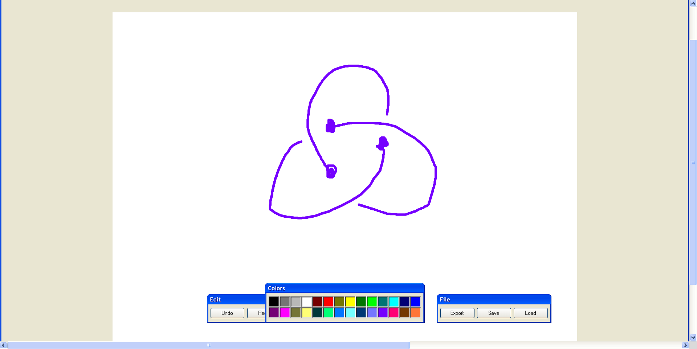

# Redux Drawing Application

## Introduction

The Redux Drawing Application is an interactive drawing board created using Redux with TypeScript, and later upgraded to Redux Toolkit. This project demonstrates the implementation of Redux, a powerful state management library, in a real-world application.

## Project Overview

This drawing application offers an array of creative features:

- **Color Selection:** Choose from a diverse palette of colors to express your creativity.
- **Drawing Tools:** Utilize your selected color to draw freehand lines and shapes.
- **Undo and Redo:** Correct mistakes or explore different artistic choices with the undo and redo functionality.
- **Export as .png:** Preserve your artwork by exporting your drawing as a high-quality .png image.

This project serves as an educational journey, teaching the fundamentals of Redux and introducing to the cutting-edge Redux Toolkit. 

## Technologies Used

- **React:** Empowering the creation of dynamic user interfaces and components.
- **Redux:** Managing the global application state with precision.
- **Redux Toolkit:** Optimizing and streamlining Redux code for better maintainability.
- **TypeScript:** Enhancing code quality and reducing errors through static typing.
- **HTML/CSS:** Styling and structuring the application with user experience in mind.
- **Canvas API:** Providing a dynamic and responsive drawing board.
- **FileSaver.js:** Enabling users to save their artwork as .png files effortlessly.

## Features

The Redux Drawing Application boasts a range of features to enhance your drawing experience:

- **Effective Global State Management:** Harnessing Redux for comprehensive application-wide state control.
- **Seamless Debugging:** Using Redux DevTools for efficient debugging and state inspection.
- **Enhanced Performance:** Upgrading to Redux Toolkit for cleaner code and improved application performance.
- **Intuitive User Interface:** Creating an intuitive and user-friendly drawing board with interactive tools.
- **Artwork Preservation:** Allowing users to export their creations as .png files for lasting memories.

## Installation

Getting started is straightforward:

1. Clone the repository: `git clone https://github.com/sultanby/FullstackReactWithTS.git`
2. Navigate to the project directory: `cd redux-paint`
3. Install dependencies: `npm install`
4. Start the development server: `npm start`

## Usage

Follow these simple steps to explore your artistic side:

1. Launch the application in your web browser.
2. Select a color from the vibrant palette.
3. Use the versatile drawing tools to craft your artwork.
4. Correct any mistakes or experiment freely with the undo and redo options.
5. Save your masterpiece as a .png file to cherish your creativity.