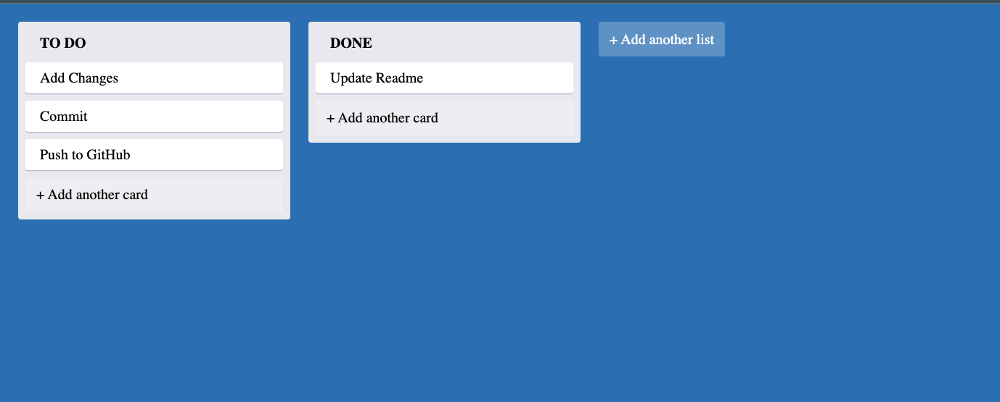

# Trello Clone App

## Table of Contents

- [Introduction](#introduction)
- [Features](#features)
- [Technologies Used](#technologies-used)
- [Installation](#installation)
- [Usage](#usage)

## Introduction

The Trello Clone App is a full-stack application that provides a simplified version of a Kanban board, similar to popular tools like Trello. It allows users to create boards, add tasks, and organize them into columns, providing an efficient way to manage projects and tasks.

## Features

- **Create boards:** Users can create multiple boards to organize different projects or tasks.
- **Add and manage tasks:** Users can add, edit, and delete tasks on their boards.
- **Organize tasks into columns:** Users can create custom columns on their boards and move tasks between columns.
- **Drag-and-drop functionality:** Tasks can be moved within and between columns using drag-and-drop.
- **User-friendly interface:** The app features an intuitive and responsive user interface for easy task management.

## Technologies Used

- **Frontend:** HTML, CSS, JavaScript, React.js
- **Backend:** Node.js, Express.js

## Installation

1. Clone the repository: `git clone https://github.com/sultanby/FullstackReactWithTS.git`
2. Navigate to the project directory: `cd treello-clone`
3. Install frontend dependencies: `cd backend && npm install`
4. Install backend dependencies: `cd .. && npm install`
5. Start the server: `npm start` in the `trello-clone/backend` directory.
6. Start the frontend: `npm start` in the `trello-clone` directory.

## Usage

1. Create a new board for your project or task list.
2. Add tasks to your board and organize them into columns.
3. Use drag-and-drop to move tasks within and between columns.
4. Edit or delete tasks as needed.
5. Stay organized and manage your projects efficiently!

## Contributing

Contributions are welcome! If you find any bugs or have suggestions for improvements, please open an issue or create a pull request.
